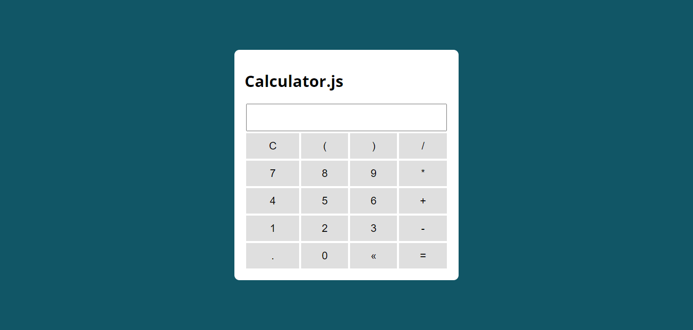

# Simple-Calculator

🚀 A very simple calculator with Javascript to exercise 💪🏻

## Screenshot

Click on the image above to see in production 👆

## 👾 Technologies

- HTML
- CSS
- Javascript

## License

[MIT](./LICENSE.md)
